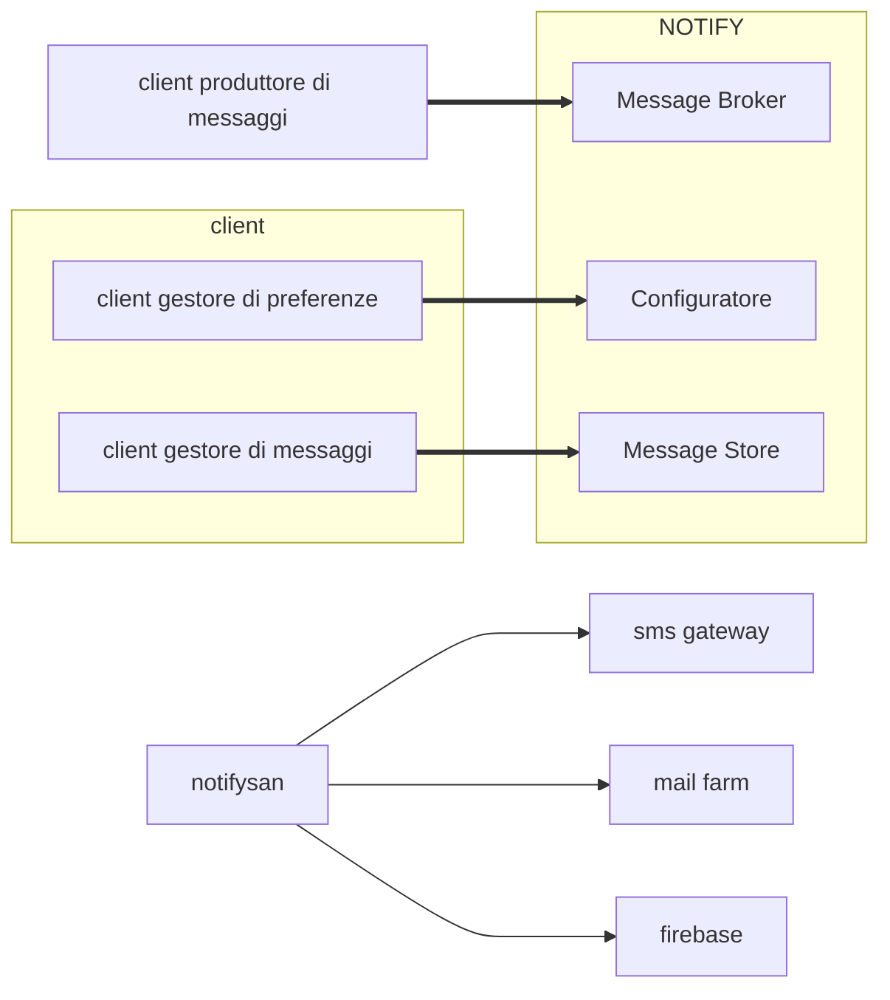
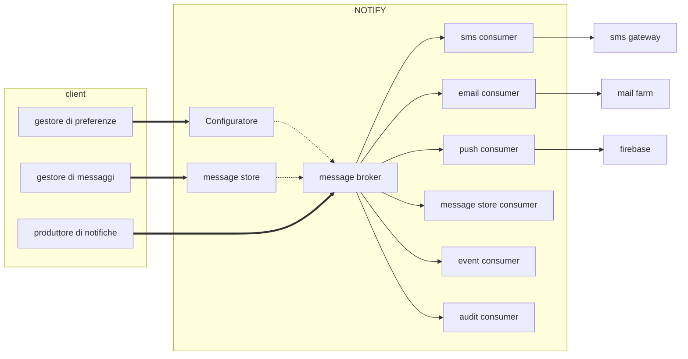
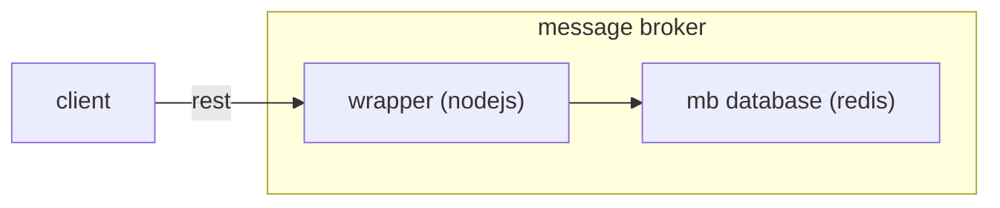
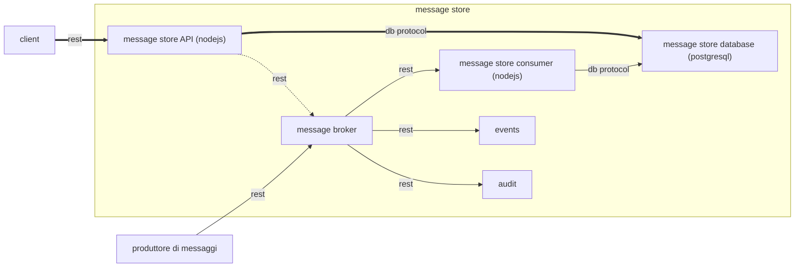
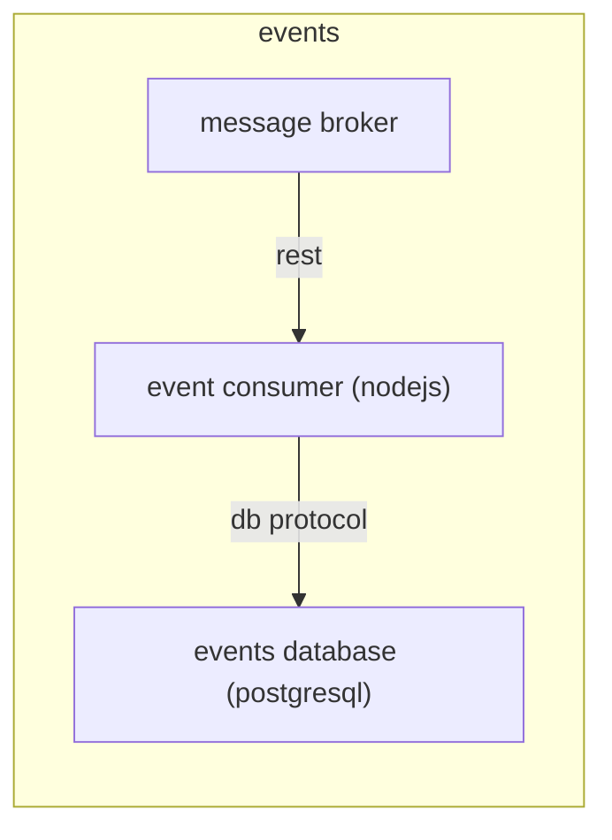
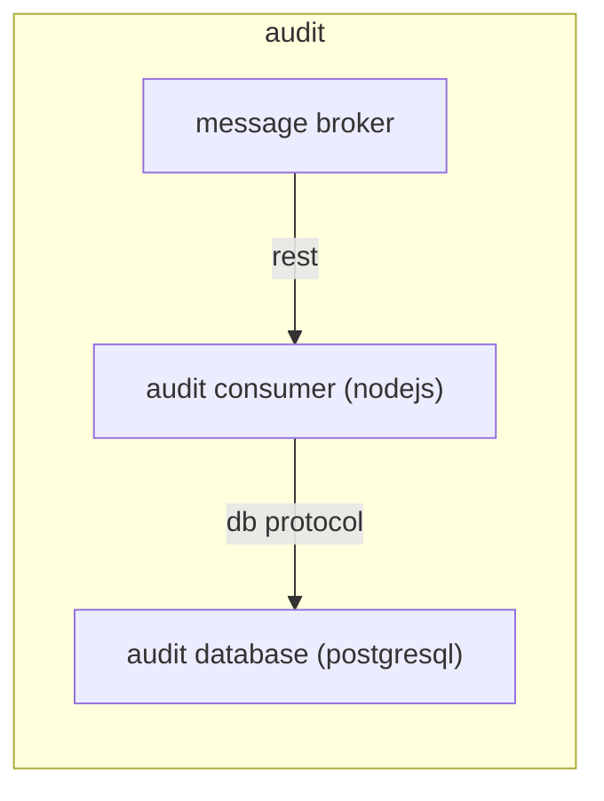
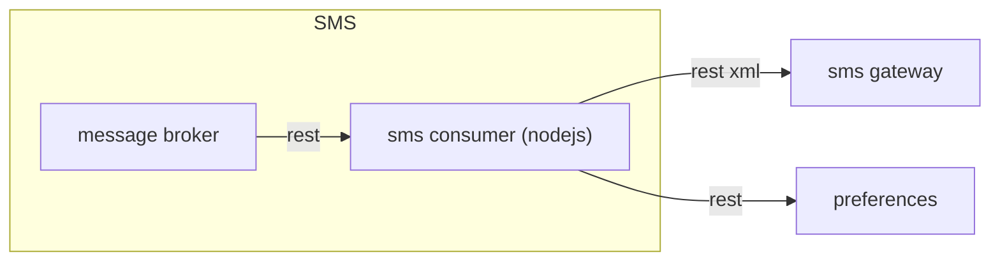
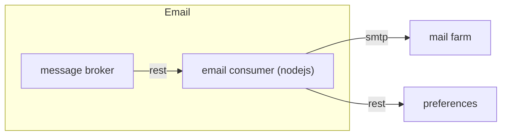
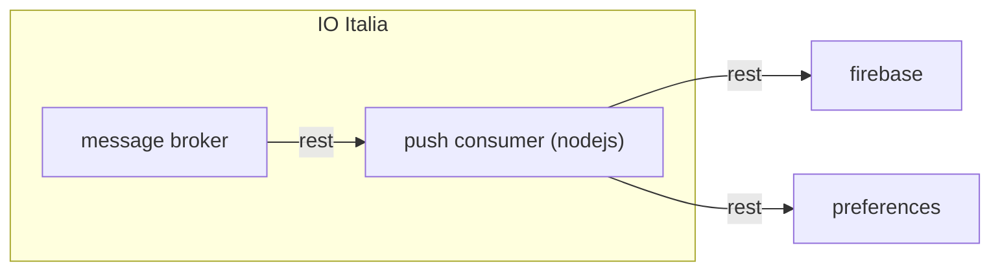

  
# Piattaforma di notifica per il sistema sanità  
NOTIFY costituisce la piattaforma di notifica messaggi utente dispiegata a livello di Sistema informativo Regionale per la sanità. La piattaforma abilita le comunicazioni delle pubbliche amministrazioni locali verso i cittadini.
La piattaforma favorisce l’interazione su canalità tradizionali quali email, sms e di nuova generazione ad esempio push-notification su Mobile App e desktop.
E' un clone ed un estensione del notificatore cittadini:
https://github.com/csipiemonte/notify 

## Componenti di piattaforma
La piattaforma si articola delle seguenti componenti che sono state progettate per consentire un'esperienza d'uso ottimizzata per i servizi applicativi che aderiscono ad NOTIFY.

</br>

| Notificatore [NOTIFY]                                    | Message Store [MS]                          |
|-------------------------------------------------|---------------------------------------------|
| Motore per la gestione delle notifiche messaggi |  Archivio delle notifiche personali ricevute |

Le preferenze nel notificatore sanità rispetto al notificatore cittadini si trovano su applicativo configuratore dove si trovano le anagrafiche degli utenti raggiungibili dalle notifiche.


## Disegno architetturale

### Collaborazione tra sistemi
Lo schema seguente descrive le macrosistemi che interagiscono con la piattaforma di notifica (NOTIFY).



### Notify
Lo schema seguente illustra le componenti della piattaforma di notifica (NOTIFY).



#### Message Broker
Il Message Broker si occupa di instradare i messaggi tra i vari componenti del sistema. Implementa il pattern del Virtual Topic.
L'uso di un Message Broker consente una interazione asincrona tra il sistema e i suoi client garantendo quindi una affidabilità migliore e tempi di risposta più brevi.
Dal punto di vista logico si è implementato il pattern del Virtual Topic. Questo consente mantenere la semantica *"ogni messaggio è consumato esattamente una volta"* indipendentemente dal numero di consumatori.

Dal punto di vista del deployment il Message Broker è installato su tre macchine indipendenti. Sia la parte applicativa (realizzata in node.js) che la parte di storage (realizzata con Redis) sono presenti in triplice ridondanza. In particolare le istanze di rete sono configurate in un cluster di tipo master-slave con sentinelle (ovvero sensori in grado di rilevare gli eventuali malfunzionamenti per poi riportare il sistema ad uno stato di funzionamento).




#### Preferences
Questo modulo si occupa di contattare il configuratore per gestire i contatti digitali dei cittadini e le relative preferenze di notifica.

#### Message Store
Questo modulo si occupa di gestire messaggi degli utenti.
E' costituito da un database PostGre che memorizza i messaggi e da un applicativo scritto in node.js che espone l'archivio sottoforma di API Rest. La sicurezza è gestita tramite token JWT. 
La parte applicativa può essere configurata per tracciare su un topic del Message Broker eventi relativi alle attività del sistema (*events*) e, indipendentemente, le attività dell'utente (*audit*).
Il sistema è popolato dal corrispondente consumatore che scoda i messaggi presenti sul Message Broker. L'utente può eseguire un determinato set di tipi di ricerche ed impostare la data in cui è stato letto ogni messaggio.
Dal punto di vista del deployment la parte applicativa consiste in un cluster di tre node.js disposti su tre macchine differenti e il database PostGre as a service fornito dall'infrastruttura del CSI Piemonte. In virtù della proprietà *stateless* del protocollo REST non occorre alcun tipo di sincronizzazione tra i vari nodi.




#### Events  Consumer
Questo modulo ha il compito di tracciare le attività dei componenti del sistema. E' costituito da un database PostGre che contiene i record corrispondenti alle attività del componente (ad esempio: "letto messaggio dal topic", "errore di accesso al database", "messaggio correttamente inoltrato", ...) e da un consumer che si occupa di inserire sul database le informazioni dedotte dagli eventi generati dai vari componenti.
Lo schema di deployment è costituito da un cluster di tre consumatori e il database PostGre as a service.



#### Audit Consumer
Questo modulo ha il compito di tracciare le attività degli utenti. E' costituito da un database PostGre che contiene i record corrispondenti alle attività dell'utente (ad esempio: "invocato GET su url xyz") e da un consumer che si occupa di inserire sul database le informazioni dedotte dagli eventi generati dai vari componenti.
Lo schema di deployment è costituito da un cluster di tre consumatori e il database PostGre as a service.


#### SMS Consumer
E' il consumatore relativo agli SMS. E' collegato alla relativa coda sul Message Broker da cui estrae i messaggi. Per ogni messaggio, tramite le opportune API, accede al modulo delle preferenze per ottenere il numero di telefono a cui inviare l'SMS. Ottenuta questa informazione confeziona la chiama all'SMS Gateway che si occuperà del delivery vero e proprio.


#### Email Consumer
E' il consumatore relativo alle email. E' collegato alla relativa coda sul Message Broker da cui estrae i messaggi. Per ogni messaggio, tramite le opportune API, accede al modulo delle preferenze per ottenere l'indirizzo a cui inviare l'email. Ottenuta questa informazione confeziona la chiama alla Mail Farm che si occuperà del delivery vero e proprio.



#### Push Consumer
E' il consumatore relativo alle notifiche push. E' collegato alla relativa coda sul Message Broker da cui estrae i messaggi. Per ogni messaggio, tramite le opportune API, accede al modulo delle preferenze per ottenere i token necessari ad inviare le notifiche ai dispositivi registrati dall'utente. Ottenuta questa informazione confeziona la chiama a Firebase che si occuperà del delivery vero e proprio.


  
## Rilascio chiavi di accesso JWT alla piattaforma
Il sistema ha la necessità di controllare e tracciare le attività dei client che lo usano. Per soddisfare questi requisiti ad ogni client è assegnato un token JWT che include le informazioni necessarie per svolgere tutte le funzioni richieste. Tale token, la cui conservazione e riservatezza sono a cura del client, è rilasciato al fruitore all'atto della sottoscrizione al servizio NOTIFY.

### Processo per il rilascio di un token al client
Il token contiene le informazioni necessarie affinchè il sistema possa inviare le notifiche per conto del client. Ove le informazioni fornite debbano essere cambiate, ad esempio perchè si vuole dismettere una canalità o sono cambiate le credenziali per le email, deve essere rilasciato un nuovo token. La prassi richiede che sia rilasciato un token differente per ogni modulo con cui è necessario interfacciarsi. Ad esempio un client complesso potrebbe disporre di un token per inviare le notifiche, uno per usare le preferenze e uno per usare il message store.

### Registrazione del servizio di business
  Il servizio di business in fase di registrazione deve fornire le seguenti informazioni:                                                                                                                                               

| **nome**              | **descrizione**                                                                                                                                                                                                                                                                                               |
|-----------------------|---------------------------------------------------------------------------------------------------------------------------------------------------------------------------------------------------------------------------------------------------------------------------------------------------------------|
| nome servizio         | Identificativo univoco del servizio ( se disponibile utilizzare un identificativo già presente nell'ecosistema di riferimento).|
| email di riferimento  | Email di contatto del capo progetto del servizio, questa informazione verrà utilizzata esclusivamente per l'invio di token di accesso o altre informazioni di servizio.|
| tags                  | Attributi del servizio utili come filtri in fase presentazione all'utente dei servizi di notifica. Consigliato un confronto con il gruppo di Governo per l'attribuzione dei tags al servizio.|
| canalità offerte      | Specificare le canalità offerte dal servizio di business: email, sms, push.<br>N.B.:<br>  Nel caso di **push** è necessario esplicitare la chiave token di FireBase legata all'applicazione web che riceve le notifiche. Da richiedere al progettista responsabile dello sviluppo del front-end.<br> Nel caso di **sms** è necessario indicare gli estremi del progetto SMS (a cura del referente di progetto CSI)<br>  Nel caso di **email** è necessario indicare una mail mittente valida e registrata presso il provider. esempio mail: "Sportello Facile" \<sportellofacile@torinofacile.it\> Se il gestore del servizio di posta è CSI-Piemonte è necessario che l'indirizzo sia correttamente censito. Se il gestore del servizio di posta non è il CSI-Piemonte è necessario che il gestore esterno aggiunga al loro record SPF sul DNS i server CSI di uscita "include:_spfmailfarmnet.csi.it", questa condizione è necessaria affinchè le mail siano correttamente recapitate all'utente. La dimensione del messaggio di posta influisce suoi tempi di evasione dei messaggi a causa del tempo di calcolo della firma DKIM, si prega di minimizzare la grafica e il testo dei messaggi.|
| tipo applicazione     | Se l'applicazione è rivolta ai cittadini oppure agli operatori (informazione utile solo nel caso di accesso alle preferenze). L'applicazione deve essere opportunamente autorizzata nel caso non siano i cittadini ad accedere alle proprie preferenze.|

Ad ogni servizio di business è associata una chiave JWT di accesso alle API di sottomissione notifiche e le chiavi JWT dei canalità di front-end responsabili del setting delle preferenze utente e consultazione messaggi.

Per il rilascio dei token di accesso contattare il referente CSI della piattaforma di notifica.

  
## Getting started

Il sistema di notifica si basa su un message broker che indirizza ai vari canali le notifiche.
Per contattare il *Message Broker* è necessario disporre di un token di autorizzazione rilasciato durante il processo di accreditamento al notificatore ed associato al singolo servizio di business. 
Ogni richiesta inviata deve avere l'header ```x-authentication``` valorizzato con il token.

Parte integrante della piattaforma di notifica e la componente *Preferences* che detiene i contatti digitali dell'utente e preferenze per singolo servizio. Il comportamento di default del notificatore prevede che il messaggio venga recapitato al cittadino rispettando le preferenze dell'utente stesso. Se l'utente **non ha attivato le preferenze**, il sistema di business può inviare un messaggio all'utente esplicitando il contatto digitale nel messaggio stesso.

Il sistema di business ha inoltre la facoltà di invertire il comportamento di default (messaggi trusted, vedere paragrafi successivi) dando priorità al contatto esplicitato del messaggio, in questo scenario il sistema di notifica non tiene conto della preferenza dell'utente. L'utilizzo di questa feature è concessa esclusivamente ai sistemi di business che detengono preferenze utente esterne al sistema centrale *Preferences*.

Il sistema gestisce una semplice forma di priorità. Essa consiste dare la precedenza ai messaggi con l'attributo ```priority``` impostato al valore "high". I messaggi a medesima priorità sono comunque serviti secondo la politica FIFO. 

### Invio notifiche

#### Ambienti di riferimento per sottomissione notifiche
La visibilità della piattaforma è limitata alla rete CSI, per accessi da reti esterne è necessario definire VPN e autorizzazioni accesso puntuali qualora non siano già disponibili.
##### Piattaforma di test
Di seguito l'endpoint di test per la sottomissione notifiche, si ricorda che l'accesso alla suddetta API è vincolata alla disponibilità del token JWT di test.
http://tst-notifysan.sanita.csi.it/notifysan-mb/

##### Piattaforma di produzione
Di seguito l'endpoint di produzione per la sottomissione notifiche, si ricorda che l'accesso alla suddetta API è vincolata alla disponibilità del token JWT di produzione.
http://notify.sanita.csi.it/notifysan-mb/
La specifica del messaggio è definita nel seguente documento:
https://github.com/regione-piemonte/notifysan/formato_messaggio.docx


### Risultato invio delle notifiche
Tramite un'apposita API è possibile avere le quadrature delle notifiche inviate.
Per poter utilizzare l'API di status dei messaggi inviati occorre avere un token abilitato alla fruizione.

#### Ambienti di riferimento per sottomissione notifiche
La visibilità della piattaforma non è limitata alla rete CSI. E' necessario comunque avere gli utenti destinatari dei messaggi presenti nel database del configuratore.

##### Piattaforma di test
Di seguito l'endpoint di test per recupero esito invio, si ricorda che l'accesso alla suddetta API è vincolata alla disponibilità del token JWT di test.
http://tst-notifysan.sanita.csi.it/notifysan-status/

##### Piattaforma di produzione
Di seguito l'endpoint di produzione per recupero esito invio, si ricorda che l'accesso alla suddetta API è vincolata alla disponibilità del token JWT di produzione.
http://notifysan.sanita.csi.it/notifysan-status/


#### Ottenere esito invio
Si può effettuare una ricerca utilizzando l'uuid del messaggio, chiamando la risorsa ```/api/v1/status/messages/{uuid}```, oppure il bulk_id, chiamando la risorsa ```/api/v1/status/messages?bulk_id={bulk_id}```.


### Gestione dei messaggi presenti nel *Message Store*
Il Message Store permette di gestire i messaggi ricevuti da un cittadino dai vari servizi.
Per contattare *Message Store* è necessario avere un token di autorizzazione che è rilasciato durante il processo di accreditamento.
Ogni richiesta inviata deve avere l'header ```x-authentication``` valorizzato con il token e l'header ```Shib-Iride-IdentitaDigitale``` valorizzato con il codice fiscale dell'utente loggato.

#### Ambienti di riferimento per gestione delle preferenze
La visibilità della piattaforma è limitata alla rete CSI, per accessi da reti esterne è necessario definire VPN e autorizzazioni accesso puntuali qualora non siano già disponibili.
##### Piattaforma di test
Di seguito l'endpoint di test per la gestione dei messaggi dell'utente, si ricorda che l'accesso alla suddetta API è vincolata alla disponibilità del token JWT di test.
http://tst-notifysan.sanita.csi.it/notifysan-messagestore/

##### Piattaforma di produzione
Di seguito l'endpoint di produzione per la gestione dei messaggi dell'utente, si ricorda che l'accesso alla suddetta API è vincolata alla disponibilità del token JWT di produzione.
http://notifysan.sanita.csi.it/notifysan-messagestore/

#### Ottenere la lista dei messaggi di un utente
Per ottenere la lista dei messaggi di un cittadino occorre invocare la risorsa ```/api/<version>/users/{user_id}/messages``` usando il verbo **GET**.
Per ottenere una lista filtrata di messaggi si può inviare nella url il parametro *filter*. I filtri si possono effettuare sui tag, sulla data di ricezione oppure sull'avvenuta lettura (per i dettagli vedere il file openapi linkato in fondo).

Ad esempio invocando **GET** ```/api/v1/users/LCSNCL83A18X999X/messages?offset=0&filter={"tag":{"match":"scadenze appuntamenti -deleted -noticed"}}&limit=50``` si otterrà il seguente risultato:
```
[
    {
        "id": "4c081248-2264-4bc9-ab4b-6d622c4cf43c",
        "bulk_id": "4c081248-2264-4bc9-ab4b-6d622c4cf43c",
        "user_id": "LCSNCL83A18X999X",
        "email": {},
        "sms": {
            "phone": "00393487982645",
            "content": "Messaggio di test trusted da http://tst-notify-sanita.csi.it/notifysan-mb"
        },
        "push": {},
        "mex": {
            "title": "Messaggio di test da http://tst-notify-sanita.csi.it/notifysan-mb",
            "body": "Lorem ipsum dolor sit amet, consectetur adipiscing elit. Sed gravida posuere nulla quis malesuada. Etiam id est vitae ipsum fermentum tristique tincidunt id lectus. Maecenas."
        },
        "io": {},
        "tag": "scadenze,pagamenti",
        "timestamp": "2021-04-27T15:06:51.000Z",
        "sender": "notify_be"
    },
    {
        "id": "4b5ea4d9-9e2f-439c-b429-b38564c6a43b",
        "bulk_id": "4b5ea4d9-9e2f-439c-b429-b38564c6a43b",
        "user_id": "LCSNCL83A18X999X",
        "email": {},
        "sms": {
            "phone": "00393487982645",
            "content": "Messaggio di test trusted da http://tst-notify-sanita.csi.it/notifysan-mb"
        },
        "push": {},
        "mex": {
            "title": "Messaggio di test da http://tst-notify-sanita.csi.it/notifysan-mb",
            "body": "Lorem ipsum dolor sit amet, consectetur adipiscing elit. Sed gravida posuere nulla quis malesuada. Etiam id est vitae ipsum fermentum tristique tincidunt id lectus. Maecenas."
        },
        "io": {},
        "tag": "scadenze,pagamenti",
        "timestamp": "2021-04-27T15:04:35.000Z",
        "sender": "notify_be"
    }
]
```

#### Ottenere un messaggio specifico di un utente
Per ottenere un messaggio specifico di un cittadino occorre invocare la risorsa ```/api/<version>/users/{user_id}/messages/{uuid}``` usando il verbo **GET**.

Ad esempio invocando **GET** ```/api/v1/users/LCSNCL83A18X999X/messages/4c081248-2264-4bc9-ab4b-6d622c4cf43c``` si otterrà il seguente risultato:
```
{
    "id": "4c081248-2264-4bc9-ab4b-6d622c4cf43c",
    "bulk_id": "4c081248-2264-4bc9-ab4b-6d622c4cf43c",
    "user_id": "LCSNCL83A18X999X",
    "email": {},
    "sms": {
        "phone": "00393487982645",
        "content": "Messaggio di test trusted da http://tst-notify-sanita.csi.it/notifysan-mb"
    },
    "push": {},
    "mex": {
        "title": "Messaggio di test da http://tst-notify-sanita.csi.it/notifysan-mb",
        "body": "Lorem ipsum dolor sit amet, consectetur adipiscing elit. Sed gravida posuere nulla quis malesuada. Etiam id est vitae ipsum fermentum tristique tincidunt id lectus. Maecenas."
    },
    "io": {},
    "tag": "scadenze,pagamenti",
    "timestamp": "2021-04-27T15:06:51.000Z",
    "sender": "notify_be"
}
```

#### Cancellare un messaggio di un utente
Per cancellare un messaggio di un cittadino occorre invocare la risorsa ```/api/<version>/users/{user_id}/messages/{uuid}``` usando il verbo **DELETE**.
La cancellazione è una cancellazione logica in quanto al messaggio viene solamente aggiunto il tag *"deleted"*.

Ad esempio invocando **DELETE** ```/api/v1/users/LCSNCL83A18X999X/messages/4c081248-2264-4bc9-ab4b-6d622c4cf43c``` si otterrà il messaggio:
```
Message deleted
```

#### Marcare i messaggi di un utente come letti o cambiarne lo stato
Per marcare i messaggi di un cittadino come "letti" oppure per cabiarne lo stato occorre invocare la risorsa ```/api/<version>/users/{user_id}/messages/status``` usando il verbo **PUT**.
Lo stato viene cambiato impostando i tag opportuni.

Ad esempio invocando **PUT** ```/api/v1/users/LCSNCL83A18X999X/status``` con il body:
```
[
  {
    "id": "4c081248-2264-4bc9-ab4b-6d622c4cf43c",
    "read_at": "any value or null to mark it as unread",
    "tag": "noticed, high-priority"
  },
  {
    "id": "67e79131-d1b4-46bb-8e7f-e69eaeb807a6",
    "read_at": null
  }
]
```
Si otterrano in risposta gli stessi messaggi.

## Authors  
CSI Piemonte