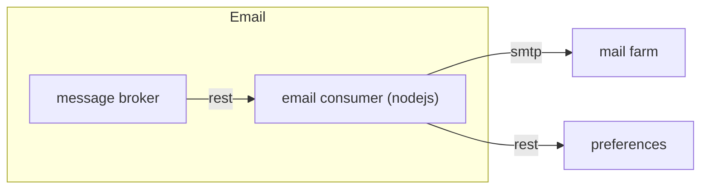

# Introduzione

Email Consumer è lo scodatore che si occupa dello scodamento dei messaggi email, legge dal messaggio lo **user_id** per contattare poi preferenze per ottenere i suoi contatti, infine contatta il mail server per l'invio della mail.



## Getting Started


Per rendere operativo il sistema occorre:
1. impostare gli opportuni valori delle variabili d'ambiente
1. editare il file di configurazione
1. avviare l'applicazione.

### Prerequisites
 
* mail server attivo configurato nel file di configurazione.
* Istanza di preferences attiva e configurata correttamente.
* Istanza del Message Broker (mb) attiva.

### Configuration

La configurazione è basata su variabili d'ambiente e file di configurazione.

Le variabili d'ambiente da valorizzare sono:
* `ENVIRONMENT`: rappresenta l'ambiente di esecuzione (ad esempio dev, tst o prod). Serve per individuare il file di configurazione secondario.

La struttura del file di configurazione è la seguente:

* `app_name` : nome dell'applicazione (obbligatorio per tracciatura degli eventi e check sicurezza)
* `mb`: contiene la configurazione per il Message Broker.
    * `queues`: contiene le informazioni per le code del message broker
        * `events`: url della coda su cui scrivere gli eventi
        * `messages`: url della coda da cui leggere i messaggi
* `log4js`: la configurazione di log4js (vedi https://www.npmjs.com/package/log4js)
* `preferences`: configurazione per il sistema api di preferences
    * `token`: token JWT per la sicurezza
    * `url`: url di preferences
* `mail_server`: configurazione del server mail


## Running

Avviare emailconsumer
```
cd src && node emailconsumer.js
```

or

```
npm start
```

# Eventi
Il sistema registra su un message broker basato su api rest gli eventi relativi all'esecuzione. Vedi il progetto "eventconsumer" per i dettagli sul formato degli eventi.

# Audit
Il sistema registra su un message broker basato su api rest i messaggi di audit. Tali messaggi sono riferiti alle http request che sono sottoposte al sistema. Le richieste sono correlate grazie all'header `X-Request-ID`. Se tale header non è popolato allora il sistema ne genera uno automaticamente. Vedi il progetto "auditconsumer" per i dettagli del formato.

