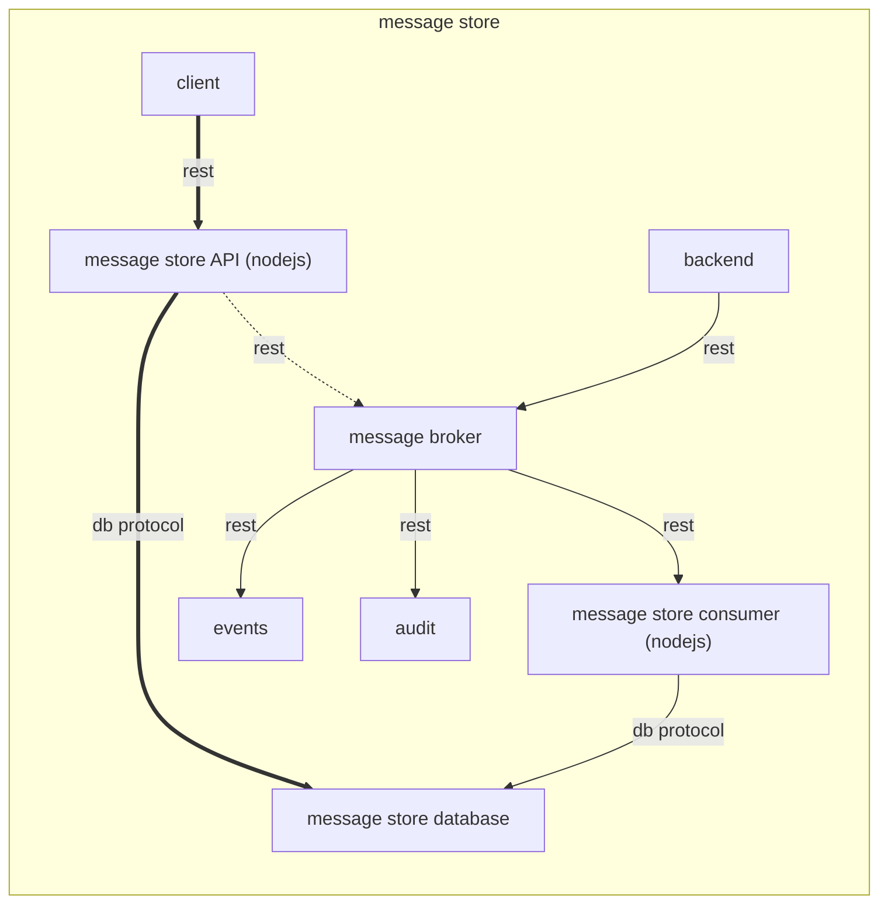

# Mexconsumer

Mexconsumer è lo scodatore che si occupa dello scodamento dei messaggi "mex", che andranno poi ad essere salvati sul database.



## Getting Started

* mail server attivo configurato nel file di configurazione.
* Istanza di preferences attiva e configurata correttamente.
* Istanza del Message Broker (mb) attiva.

### Prerequisites

* Istanza attiva di MySQL(o MariaDB) e opportunamente configurata in mexconsumer.json
* Istanza attiva del Message Broker(mb).

### Configuration

La configurazione è basata su variabili d'ambiente e file di configurazione.

Le variabili d'ambiente da valorizzare sono:
* `ENVIRONMENT`: rappresenta l'ambiente di esecuzione (ad esempio dev, tst o prod). Serve per individuare il file di configurazione secondario.

La struttura del file di configurazione è la seguente:

* `app_name` : nome dell'applicazione (obbligatorio per tracciatura degli eventi e check sicurezza)
* `mb`: contiene la configurazione per il Message Broker.
    * `queues`: contiene le informazioni per le code del message broker
        * `events`: url della coda su cui scrivere gli eventi
        * `audit`: url della coda su cui scrivere i messaggi di audit
* `log4js`: la configurazione di log4js (vedi https://www.npmjs.com/package/log4js)


### Installing

L'applicativo mexconsumer prevede la sola installazione del suo database per funzionare.

Installare database da conf/mex.sql.


## Running

Avviare mexconsumer
```
cd src && node mexconsumer.js
```

or

```
npm start
```
