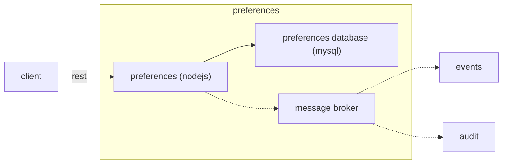

# Introduzione

*Preferences* è un sistema che espone API rest che consente la gestione delle preferenze dell'utente.
Per preferenze si intende le scelte dell'utente riferite ad un determinato servizio digitale.
Attualmente sono supportati i contatti digitali (email,push,sms) e la lingua.



# Getting Started

Per rendere operativo il sistema occorre:
1. creazione dello schema sul database con lo script `conf/preferences.sql`.
1. impostare gli opportuni valori delle variabili d'ambiente
1. editare il file di configurazione
1. avviare l'applicazione.
1. Usare i servizi (vedi `docs/preferences.yaml`)

## Prerequisites

* Istanza attiva di MySQL (o MariaDB)
* Message broker con API rest per tracciare eventi e audit (opzionale) 

## Configuration
La configurazione è basata su variabili d'ambiente e file di configurazione.
Le variabili d'ambiente da valorizzare sono:
* `ENVIRONMENT`: rappresenta l'ambiente di esecuzione (ad esempio dev, tst o prod). Serve per individuare il file di configurazione secondario.
* `PREFERENCES_MYSQL_USER`: user da usare per accedere al database
* `PREFERENCES_MYSQL_PASSWORD`: password da usare per accedere al database
* `PREFERENCES_MB_TOKEN`: il token JWT per accedere al message broker con api rest che supporta il tracciamento degli eventi e l'audit (opzionale)
* `PREFERENCES_SECURITY_SECRET`: passphrase per verificare il token JWT (opzionale)

I file di configurazione sono `conf/preferences.json` e`conf/preferences-{ENVIRONMENT}.json`. Ove lo stesso parametro sia presente su entrambi i file il valore in `conf/preferences-{ENVIRONMENT}.json` ha la precedenza.

La struttura del file di configurazione è la seguente:

* `mysql`: contiene la configurazione per la connessione al database. 
    * `host`: l'hostname del dbms
    * `database`: il nome del database a cui accedere
* `app_name` : nome dell'applicazione (obbligatorio per tracciatura degli eventi e check sicurezza)
* `mb`: contiene la configurazione per il Message Broker.
    * `queues`: contiene le informazioni per le code del message broker
        * `events`: url della coda su cui scrivere gli eventi
        * `audit`: url della coda su cui scrivere i messaggi di audit
* `server_port`: porta che utilizzerà l'istanza del server
* `log4js`: la configurazione di log4js (vedi https://www.npmjs.com/package/log4js)

# Token JWT

La sicurezza è gestita tramite token JWT, il token contiene, oltre ai parametri di default (come `iat`, `exp`, ...):
* `applications`: array dei nomi delle applicazioni per cui gli è stato abilitato l'accesso. Perchè il token sia valido per l'uso di questa applicazione nell'array deve essere presente lo stesso valore della variabile di configurazione `app_name`.
* `permissions`: array dei permessi. Per accedere ai servizi occorre il permesso "user".

La passphrase usata verificare la correttezza della firma del token è contenuta nella variabile d'ambiente `PREFERENCES_SECURITY_SECRET`
Il token JWT viene letto dal parametro nell'header `x-authentication`

# Running

Avviare preferences server 
```
cd src && node preferences.js
```

or

```
npm start
```

# Eventi
Il sistema registra su un message broker basato su api rest gli eventi relativi all'esecuzione. Vedi il progetto "eventconsumer" per i dettagli sul formato degli eventi.

# Audit
Il sistema registra su un message broker basato su api rest i messaggi di audit. Tali messaggi sono riferiti alle http request che sono sottoposte al sistema. Le richieste sono correlate grazie all'header `X-Request-ID`. Se tale header non è popolato allora il sistema ne genera uno automaticamente. Vedi il progetto "auditconsumer" per i dettagli del formato.


## Use case

Un servizio registrato nel sistema di Preferences (procedura che si trova nel portale unp-admin), che vuole inviare notifiche ad un cittadino, puo usare poche semplice APIs.

Mettiamo l'esempio di un cittadino con user_id: **cittadino-x**

E un servizio censito su preferences: **servizio_test**

**PER OGNI API RICORDARSI DI METTERE I SEGUENTI HEADER:**


1. Il cittadino dovra impostare i suoi contatti digitali all'API: 
    **PUT** *api/v1/users/cittadino-x/preferences/servizio_test*
    
    esempio body:
    ```
    {
        "sms": "333312412",
        "phone": "333998800",
        "email": "prova@consulenti.csi.it",
        "push": "7f2a370f-6d15-4400-9836-cad",
        "language": "it_IT"        
    }
    ``` 
    Così il cittadino con il codice fiscale **cittadino-x** avra impostato i suoi contatti digitali su cui essere contattato.
2. Successivamente il cittadino potrà scegliere le canalità su cui essere contattato, mettiamo esempio di un cittadino che vuole essere contattato solamente tramite notifiche push.
    
    Api da contattatare: **PUT** *api/v1/users/cittadino-x/preferences/servizio_test*
    ```
    {
        "channels": "push"
    }
    ```
    
In questo modo il servizio censito su Preferences con il nome di *servizio_test*, che ha abilitato le opportune canalità in fase di registrazione, può inviare messaggi al cittadino **cittadino-x** ma lui le riceverà **solamente** su push, in quanto ha abilitato solo le push per quel servizio.

Una volta fatto il submit del messaggio sul sistema *mb* (notify), i messaggi dell'utente possono essere visualizzabili in **Mex**.    

## Built With

* [NodeJS](https://nodejs.org) - Framework javascript usato
* [NPM](https://www.npmjs.com/) - Dependency Management

## Authors

* CSI Piemonte

## License
