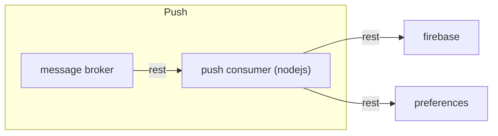

# Introduzione

puhsconsumer è lo scodatore che si occupa dello scodamento dei messaggi push che, attraverso firebase, invierà come notifica agli utenti destinatari



## Getting Started

Per rendere operativo il sistema occorre:
1. impostare gli opportuni valori delle variabili d'ambiente
1. editare il file di configurazione
1. avviare l'applicazione.


### Prerequisites
 
* Istanza di preferences attiva e configurata correttamente in pushconsumer.json
* Istanza del Message Broker (mb) attiva

### Configuration

La configurazione è basata su variabili d'ambiente e file di configurazione.

Le variabili d'ambiente da valorizzare sono:
* `ENVIRONMENT`: rappresenta l'ambiente di esecuzione (ad esempio dev, tst o prod). Serve per individuare il file di configurazione secondario.

La struttura del file di configurazione è la seguente:

* `app_name` : nome dell'applicazione (obbligatorio per tracciatura degli eventi e check sicurezza)
* `mb`: contiene la configurazione per il Message Broker.
    * `queues`: contiene le informazioni per le code del message broker
        * `events`: url della coda su cui scrivere gli eventi
        * `messages`: url della coda da cui leggere i messaggi
* `log4js`: la configurazione di log4js (vedi https://www.npmjs.com/package/log4js)
* `preferences`: configurazione per il sistema api di preferences
    * `token`: token JWT per la sicurezza
    * `url`: url di preferences
* `firebase`: configurazione di firebase


## Running

Avviare pushconsumer
```
cd src && node pushconsumer.js
```

or

```
npm start
```
