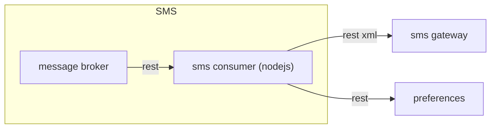

# Introduzione

smsconsumer è lo scodatore che si occupa dello scodamento dei messaggi "sms", che andranno poi ad essere inviati all'utente, prendendo i suoi contatti dal sistema preferences, o se non presente, dal messaggio. L'invio dell'sms è fatto contattando un gateway apposito.




## Getting Started

Per rendere operativo il sistema occorre:
1. impostare gli opportuni valori delle variabili d'ambiente
1. editare il file di configurazione
1. avviare l'applicazione.


### Prerequisites

* Un gateway sms da contattare per l'invio.
* Istanza di preferences attiva e configurata correttamente in smsconsumer.json
* Istanza del Message Broker (mb) attiva

### Configuration

La configurazione è basata su variabili d'ambiente e file di configurazione.

Le variabili d'ambiente da valorizzare sono:
* `ENVIRONMENT`: rappresenta l'ambiente di esecuzione (ad esempio dev, tst o prod). Serve per individuare il file di configurazione secondario.
* `DRY_RUN_SMS`: settando a true questa variabile d'ambiente, nell'invio degli sms mettere come "data" una data futura nel 2030 per evitarne l'invio effettivo

La struttura del file di configurazione è la seguente:

* `app_name` : nome dell'applicazione (obbligatorio per tracciatura degli eventi e check sicurezza)
* `mb`: contiene la configurazione per il Message Broker
    * `queues`: contiene le informazioni per le code del message broker
        * `events`: url della coda su cui scrivere gli eventi
        * `messages`: url della coda da cui leggere i messaggi
    * `token`: JWT token per contattare l'mb
* `log4js`: la configurazione di log4js (vedi https://www.npmjs.com/package/log4js)
* `preferences`: configurazione per il sistema api di preferences
    * `token`: token JWT per la sicurezza
    * `url`: url di preferences
* `sms`: configurazione del gateway per l'invio degli sms


## Running

Avviare smsconsumer
```
cd src && node smsconsumer.js
```

or

```
npm start
```

# Eventi
Il sistema registra su un message broker basato su api rest gli eventi relativi all'esecuzione. Vedi il progetto "eventconsumer" per i dettagli sul formato degli eventi.

# Audit
Il sistema registra su un message broker basato su api rest i messaggi di audit. Tali messaggi sono riferiti alle http request che sono sottoposte al sistema. Le richieste sono correlate grazie all'header `X-Request-ID`. Se tale header non è popolato allora il sistema ne genera uno automaticamente. Vedi il progetto "auditconsumer" per i dettagli del formato.

